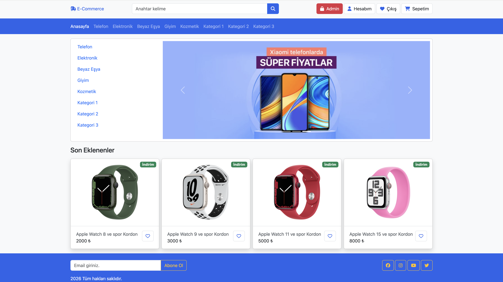
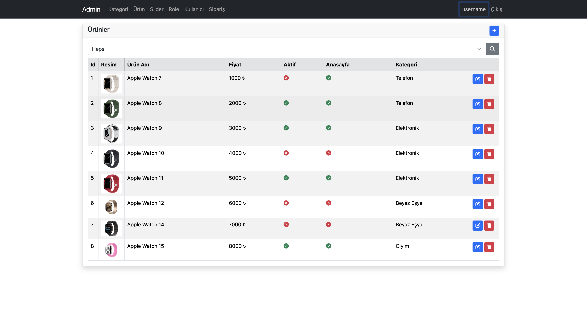
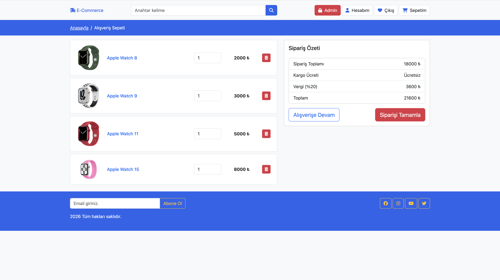
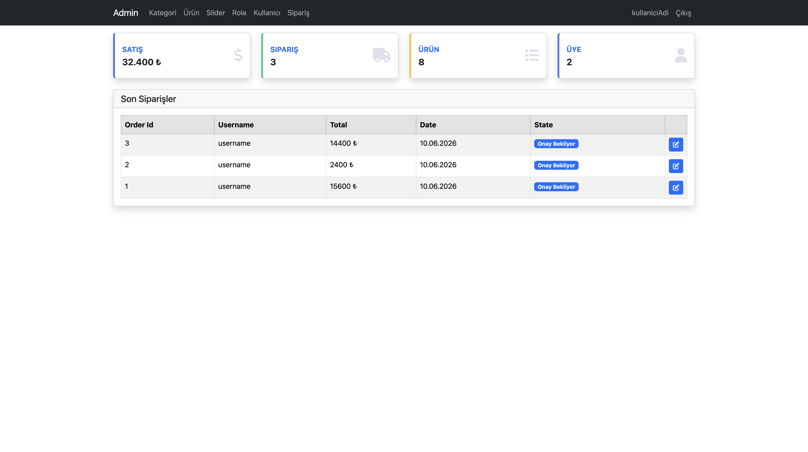
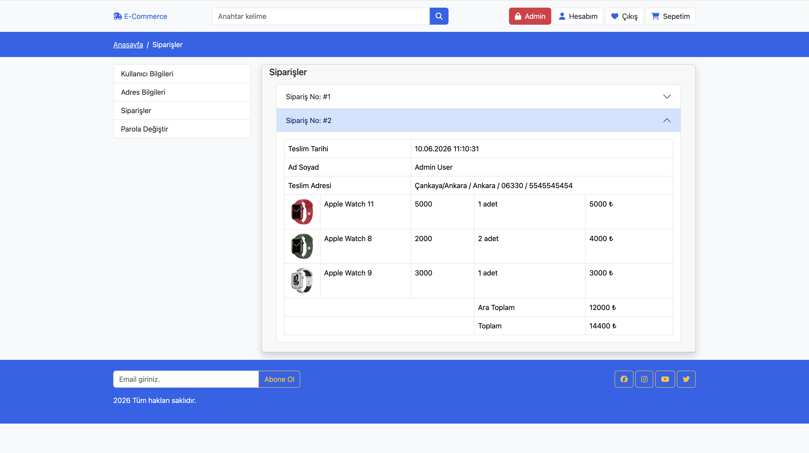

# my-dotnet-store

ASP.NET Core MVC ile yazdığım bir e-ticaret uygulaması. Ürün listeleme, sepet, ödeme ve bir admin panelinin olduğu, baştan sona kendim kurduğum bir proje.

Aslında MVC mimarisini, Entity Framework'ü ve Identity'yi düzgün öğrenmek için başladığım bir çalışmaydı; ilerledikçe gerçek bir e-ticaret akışına dönüştü. Bu yüzden hem öğrenme sürecimi hem de neler yapabildiğimi gösteren bir proje oldu.

## Neler var

Site tarafında üyelik, giriş, şifremi unuttum (e-posta ile sıfırlama) gibi işlemler ASP.NET Core Identity üzerinden çalışıyor. Ürünleri kategoriye göre listeleyebiliyor, arama yapabiliyor, detay sayfasına girebiliyorsun. Sepet kısmında ufak bir detay var: giriş yapmadan ürün eklersen sepet cookie'de tutuluyor, giriş yapınca o sepet otomatik hesabına aktarılıyor. Ödeme adımında Iyzipay'in sandbox'ını kullandım, sipariş veritabanına kaydediliyor ve kullanıcı kendi geçmiş siparişlerini görebiliyor.

Admin panelinde ise ürün, kategori, slider, rol ve kullanıcı yönetimi (ekleme/düzenleme/silme) var. Ürün eklerken görsel yükleyebiliyorsun. Gelen siparişler de buradan listelenip detaylı görülebiliyor.

## Ekran Görüntüleri

Ana sayfa


Ürünler


Sepet


Admin paneli


Siparişler


## Kullandıklarım

- ASP.NET Core 9 (MVC)
- Entity Framework Core + SQLite
- ASP.NET Core Identity (cookie tabanlı kimlik doğrulama)
- Iyzipay (sandbox) ödeme entegrasyonu
- Bootstrap 5 ve Font Awesome
- Gmail SMTP ile e-posta gönderimi

## Çalıştırmak için

.NET 9 SDK kurulu olmalı. Bir de migration'ları çalıştırmak için EF Core aracı:

```bash
dotnet tool install --global dotnet-ef
```

Sonra:

```bash
git clone https://github.com/KULLANICI_ADIN/my-dotnet-store.git
cd my-dotnet-store
```

E-posta ve ödeme bilgilerini koda gömmedim, user-secrets'ta tutuyorum. Kendi değerlerini girmen gerekiyor:

```bash
dotnet user-secrets init
dotnet user-secrets set "Email:Username" "ornek@gmail.com"
dotnet user-secrets set "Email:Password" "gmail-uygulama-sifresi"
dotnet user-secrets set "PaymentAPI:APIKey" "sandbox-api-key"
dotnet user-secrets set "PaymentAPI:SecretKey" "sandbox-secret-key"
```

Iyzipay sandbox anahtarlarını sandbox-merchant.iyzipay.com adresinden ücretsiz alabilirsin.

Veritabanını oluştur ve çalıştır:

```bash
dotnet ef database update
dotnet run
```

Uygulama açıldığında `http://localhost:5045` üzerinden girebilirsin.

## Demo hesaplar

Uygulama ilk açıldığında bu hesaplar otomatik oluşuyor:

- Admin: `admin@gmail.com` / `1234567`
- Müşteri: `customer@gmail.com` / `1234567`

## Ödeme testi

Sandbox olduğu için gerçek kart gerekmez. Test kartı:

- Kart no: `5528 7900 0000 0008`
- Son kullanma: `12/30`
- CVV: `123`

## Notlar

Bu benim ilk kapsamlı projem, o yüzden eksikleri olabilir. Geri bildirime ve önerilere açığım. Bu proje MVC mimarisi ile birlikte Entity ve Identity konularını daha iyi pekiştirebilmek amacıyla yapılmıştır. İleriki süreçlerde WebApi konusunu da pekiştirdikten sonra React ve Asp.Net WebApi kullanarak daha kapsamlı E-Ticaret Sitesi geliştirmeyi hedefliyorum.